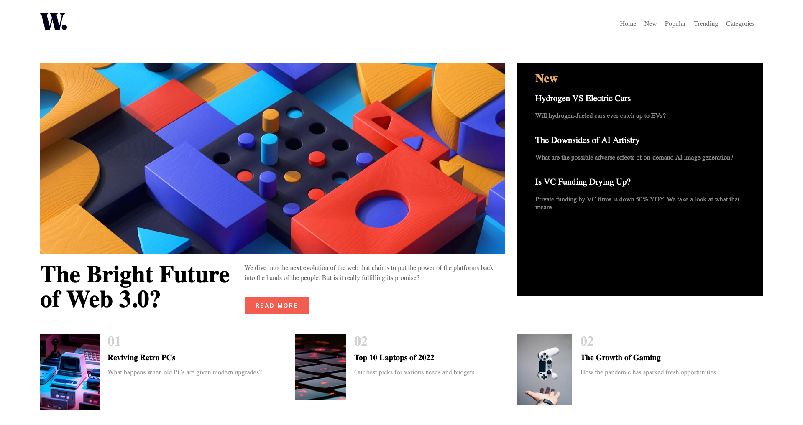
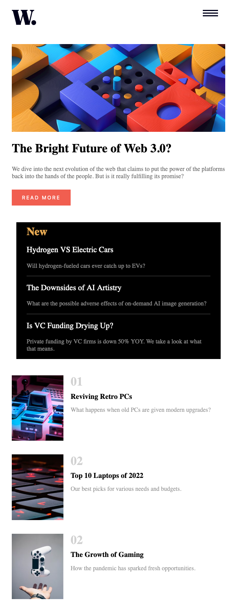
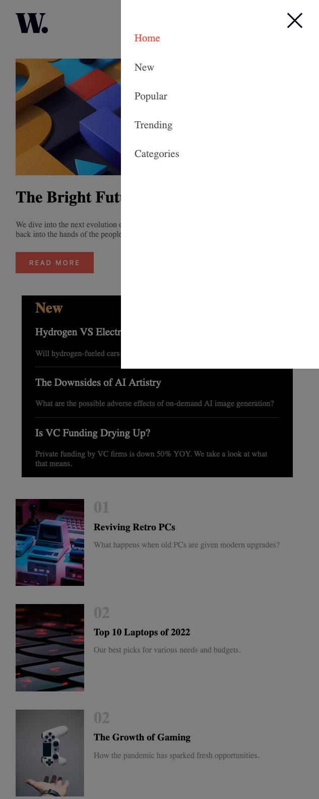

# Frontend Mentor - News homepage solution

This is a solution to the [News homepage challenge on Frontend Mentor](https://www.frontendmentor.io/challenges/news-homepage-H6SWTa1MFl). Frontend Mentor challenges help you improve your coding skills by building realistic projects. 

## Table of contents

- [Overview](#overview)
  - [The challenge](#the-challenge)
  - [Screenshot](#screenshot)
  - [Links](#links)
  - [My process](#my-process)
  - [Built with](#built-with)
  - [Continued development](#continued-development)
  - [Useful resources](#useful-resources)
- [Author](#author)
- [Acknowledgments](#acknowledgments)

**Note: Delete this note and update the table of contents based on what sections you keep.**

## Overview
I really appreciate you taking time to visit this repo. I am aware of the fact that I have not implemented all things properly. I always get stuck into details instead of just
finishing a project. So, I decided to the leave some issues or don't pay much to minor details.
If you find anything wrong or that can be improved, please let me know. 

### The challenge

Users should be able to:

- View the optimal layout for the interface depending on their device's screen size
- See hover and focus states for all interactive elements on the page
- **Bonus**: Toggle the mobile menu (requires some JavaScript)

### Screenshot

### Links

- Solution URL: [Add solution URL here](https://your-solution-url.com)
- Live Site URL: [Add live site URL here](https://your-live-site-url.com)

### Built with
- Semantic HTML5 markup
- Flexbox
- Mobile-first workflow
- Javascript

### Continued development

I plan to more consistent to the design: get more close to the design. I have to learn about responsive image.
Styling and layout of the small component.

### Useful resources

- [Example resource 1]: Most of things that I implemented, I learned from book called 'CSS in Depth'.

## Author

- Github - Ranjeet Kumar: (https://github.com/ranjiitk121)
- Frontend Mentor - [@ranjiitk121](https://www.frontendmentor.io/profile/ranjiitk121)

## Acknowledgments
Thanks for taking a look at this repo. Feel free to leave review.
